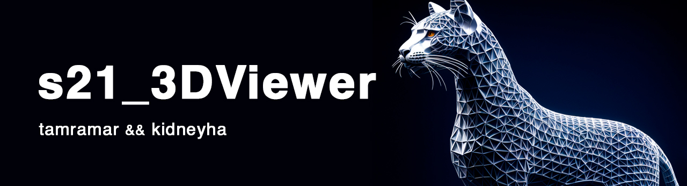
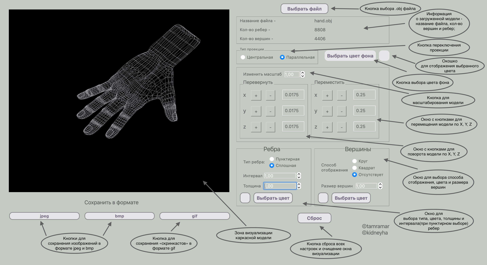

# s21_3DViewer_v1.0

## Содержание

## Описание

Идея данной работы заключается в том, чтобы воспроизводить заранее созданные 3D объекты в нашем приложении. Для выбора доступны файлы с расширением `.obj`. Выбираете объектный файл, которые хотите просмотреть и наша программа покажет вам его. 

Вы можете ознакомиться с видеоинструкцией ниже, после чего будет дублирование информации в текстовом виде. Приятного пользования! 

### Возможность приложения:

    - Подсчет вершин/ребер
    - Изменение проекции
    - Приближение/отдаление объекта
    - Перемещение объекта
    - Повороты объекта
    - Работа с ребрами объекта
    - Работа с вершинами объекта
    - Сохранение изображение в различных форматах
    - Сброс всех настроек по умолчанию

## Иструкция по использованию для пользователя

1. Необходимо установить наше приложение на ваше устройство:

    - Копируем репозиторий к себе на устройство любым удобным образом
    - Заходим в нашу папку через терминал и прописываем `make` 

    После этого наше приложение уже установлено и готово к использованию

2. Первым делом после запуска рекомендуется выбрать файл: 
    - Данная кнопка находится справа сверху
    - Выбор файла из всех ваших возможных (можно выбрать заранее загруженные файлы в наш проект)
        - Загруженные файлы можно найти в папке **obj**

    После выбора файла, он отображается в левом черном окне
3. После этого вы уже разными способами можете взаимодействовать с объектом
    - Подсчет вершин и ребер:
        - Происходит автоматически после выбора файла
    - Изменение проекции автоматически выставлена на **Параллельную**, вы можете мышкой поменять на **Центральную**
       - Разница этих двух проекций заключается в том, что **центральная** проекция отображается от одной центральной точки, то есть, объект будет привязан именно к ней, в отличие от **параллельной**.
    - Приближение и отдаление объекта:
        - Имеется возможность изменять масштаб изображения, он варьируется от 1.00 до 40.00.
        - Также в **центральной** проекции есть возможность приближать объект к себе благодаря увеличению и уменьшению значения *Z* (это является перемещением объекта)
    - Перемещение объекта и повороты объекта:
        - Перемещение и повороты осуществляются благодаря соответсвующим кнопкам "+" и "-"
        - Перемещать и поворачивать объект можно по трем плоскостям *X*, *Y* и *Z* соответственно
        - Прежде чем нажимать на кнопку "+" или "-", нужно чтобы было указано какое-либо значение, на которое оно будет сдвигаться (Значения можно указать в окошке справа, по умолчанию они уже указаны)
    - Работа с ребрами объекта:
        - Выбор пунктирной отрисовки или сплошной. По умолчанию выставляется сплошная.
        - Интервал между линиями в пунктирной отрисовке варьируется от 1.00 до 20.00
        - Толщина линий варьируется от 1.00 до 60.00
        - Выбор цвета линий
    - Работа с вершинами объекта:
        - Выбор отображения вершин: круг, квадрат или без вершин (отсутствие)
        - Размер вершин варьируется от 1.00 до 50.00
        - Выбор цвета вершин
    - Сохранение изображения:
        - Под вашей моделью вы можете наблюдать три кнопки для сохранения, которые переобразуют вашу модель в данный формат
    - Сброс всех настроек до начального:

## Инструкция для тестировщика 

Для работы с нашей программой предусмотрены следующие команды:

    - *install* - позволяет скачать все необходимое для запуска
    - *uninstall* - удаляет все, что было скачено в ходе прошлой команды
    - *dvi* - открытие README
    - *dist* - архивирование наших файлов
    - *tests* - запуск тестирования
    - *gcov_report* - запуск тестирования и открыте окна с покрытиями нашего кода
    - *check* - проверка на google style
    - *clean_test* - очистка файлов для тестов
    - *clean* - очистка исполняемых файлов
    
